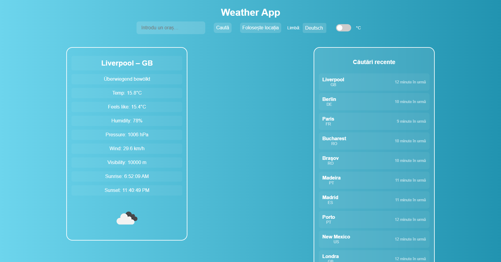

# 🌤️ Weather App - Modern JavaScript Weather Application

> O aplicație meteo completă construită cu vanilla JavaScript, integrând API-uri reale și best practices moderne.

[Demo Live](https://MunteanuMarian19.github.io/weather-app) | [Cod Sursă](https://github.com/MunteanuMarian19/weather-app)

---

## 🎯 Despre Proiect

Această aplicație meteo îți oferă date actualizate în timp real pentru orașe din întreaga lume. Este construită folosind doar **JavaScript Vanilla**, fără framework-uri externe, într-o arhitectură modulară.  
Aplicația detectează automat locația utilizatorului, are fallback pe IP, suportă mai multe căutări, jurnalizare internă pentru dezvoltatori și poate exporta istoricul căutărilor.

Scopul proiectului a fost învățarea modului în care putem construi o aplicație completă, scalabilă și ușor de întreținut cu JavaScript modern.

---

## ✨ Funcționalități

### ✅ Core Features

- Căutare meteo după oraș
- Detectare automată a locației
- Fallback pe IP dacă Geolocation e blocat
- Conversie între Celsius și Fahrenheit
- Istoric căutări cu persistare în localStorage

### 🚀 Advanced Features

- Export al istoricului de căutări în fișier `.txt`
- Clear log / clear history buttons
- Logging modular pentru debug
- Detectare automată `localhost` vs `GitHub Pages` (env switch)

### 🔍 Technical Highlights

- **Arhitectură modulară** cu ES Modules
- Separarea clară a logicii: API, UI, Logger, Config
- Logging controlat prin `config.js`
- Responsive design fără framework-uri externe

---

## 🛠️ Tehnologii Utilizate

### 🧩 Frontend

- **JavaScript (ES6+)** – Modular & Vanilla
- **HTML5** – Semantic și accesibil
- **CSS3** – Responsive design

### 🌐 APIs & Services

- **OpenWeatherMap API** – Date meteo în timp real
- **Geolocation API** – Locație exactă
- **IP API (ipapi.co)** – Fallback geolocation

### 🛠 Tools & Workflow

- **VS Code** – Editor principal
- **Git & GitHub** – Version control și colaborare
- **GitHub Pages** – Hosting gratuit și rapid

---

## 🚀 Demo și Screenshots

### Mobile Responsive


### Search Results View



### Desktop View


---
## Project Structure
weather-app/
├── index.html                  # Entry point
├── styles.css                  # Styling principal
├── app.js                      # Orchestrarea aplicației
├── modules/                    # Folder pentru module JavaScript
│   ├── config.js               # Configurare centralizată
│   ├── weather-service.js      # Integrare API meteo
│   ├── location-service.js     # Servicii de locație
│   ├── history-service.js      # Istoric și persistență
│   ├── logger.js               # Sistem de logging
│   └── ui-controller.js        # Management interfață
├── assets/                     # Imagini și resurse statice
│   ├── Capture.PNG             # Screenshot 1
│   ├── Capture2.PNG            # Screenshot 2
│   └── Capture3.PNG            # Screenshot 3
└── README.md                   # Documentație completă

---

## 📦 Instalare și Rulare

### Cerințe

- Browser modern (Chrome, Firefox, Edge, Safari)
- API key de la [OpenWeatherMap](https://openweathermap.org/api)

### Setup Local

```bash
# Clone repository
git clone https://github.com/MunteanuMarian19/weather-app.git
cd weather-app

# Adaugă API key în config.js
# Deschide modules/config.js și înlocuiește valoarea lui API_KEY cu cheia ta
